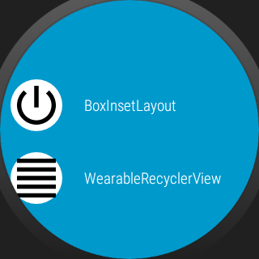
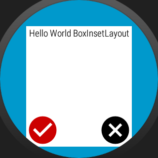
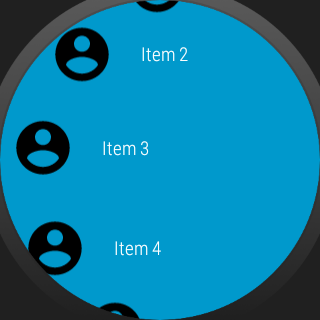
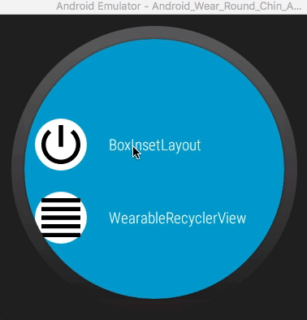

# Wearables Layouts Round and NoRound

Exemplo usando BoxInsentLayout e WearableRecyclerView 

Example
--------

Trabalho Extra Cadeira de Wearables
--------
Professor : Leandro Malkes (leo.malkes@gmail.com)
